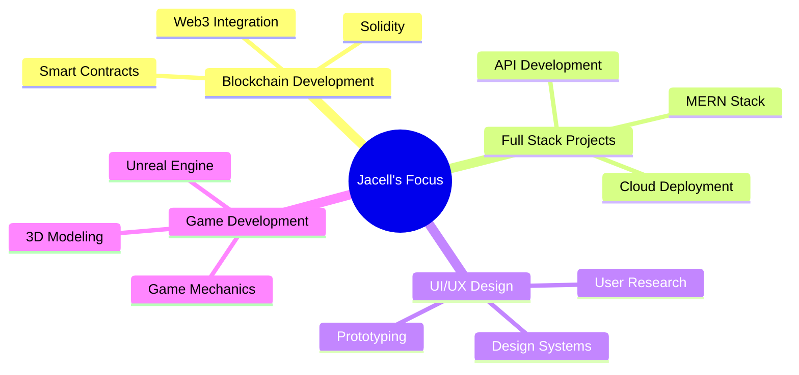

<div align="center">

# 👋 Hey, I'm Jacell Jamble!


<br>


<br>

```ascii
╔══════════════════════════════════════════════════════════════╗
║  🎓 Computer Engineering Student @ Fr.CRCE                  ║
║  🏆 6x Hackathon Winner                                     ║
║  💻 Fullstack Developer | 🎨 UI/UX Designer                 ║
║  🎮 Game Developer | ⛓️ Learning Blockchain                 ║
║  🌱 Constantly seeking growth & collaboration               ║
╚══════════════════════════════════════════════════════════════╝
```

<br>

[](https://instagram.com/jacelljamble) 
[](https://linkedin.com/in/jacell-jamble-8236ba286)
[](#)
[](mailto:your.email@example.com)


</div>

## 🚀 About Me


```javascript
const jacell = {
    location: "Mumbai, India",
    education: "Computer Engineering Student",
    currentFocus: "Blockchain & Web3 Development",
    passions: ["Coding", "Design", "Gaming", "Innovation"],
    hackathonWins: 6,
    
    currentlyLearning: [
        "Smart Contracts",
        "Solidity",
        "Web3 Integration",
        "Advanced React Patterns"
    ],
    
    funFact: "I debug with console.log() and I'm proud of it! 😄"
};
```

<br clear="right"/>


## 💻 Tech Stack

<div align="center">

### 🔤 Languages
 
 
 


### 🎨 Frontend
 
 


### ⚙️ Backend
 


### 🗄️ Database & Tools


### 🎨 Design
 
 


### 🎮 Game Development


</div>


## 🏆 Hackathon Achievements

<div align="center">

<table>
<tr>
<td align="center" width="25%">
<br>
<b>6x Winner</b><br>
<sub>Consistent Excellence</sub>
</td>
<td align="center" width="25%">
<br>
<b>Problem Solver</b><br>
<sub>Innovative Solutions</sub>
</td>
<td align="center" width="25%">
<br>
<b>Team Player</b><br>
<sub>Leadership & Collaboration</sub>
</td>
<td align="center" width="25%">
<br>
<b>Quick Learner</b><br>
<sub>Adaptable & Fast</sub>
</td>
</tr>
</table>

</div>


## 🎯 Current Focus

<div align="center">



</div>


## 📊 GitHub Stats

<div align="center">


<br><br>


<br><br>

### 📈 Contribution Graph


<br><br>

<!-- Animated Contribution Streak -->
### 🔥 Contribution Streak Animation


<br>

<!-- 3D Contribution Graph -->
### 🌊 3D Contribution Wave


<br>

<!-- Animated Stats Cards -->
### 📊 Dynamic Stats


<br>

<!-- Circular Language Chart -->
### 🎨 Language Distribution


<br>

<!-- GitHub Metrics - Extensive Animated Stats -->
### 📈 Detailed Metrics & Achievements


<br>

<!-- WakaTime-like coding activity -->
### ⌨️ Coding Activity


<br>

<!-- Isometric Contribution Graph -->
### 🎲 Isometric Contributions


<br>

<!-- GitHub Trophies with Animation -->
### 🏆 GitHub Trophies


<br>

<!-- Animated Commit Graph -->
### 💫 Commit Activity


</div>


## 💭 Random Dev Quote

<div align="center">


</div>


## 🌟 Top Contributed Repositories

<div align="center">


</div>


## 🤝 Let's Connect!

<div align="center">

I'm always open to interesting conversations, collaboration opportunities, and new projects!

**Feel free to reach out if you want to:**
- 💡 Collaborate on a project
- 🎯 Participate in a hackathon
- 💬 Discuss tech, design, or games
- 🚀 Build something amazing together

<br>

[](https://instagram.com/jacelljamble) 
[](https://linkedin.com/in/jacell-jamble-8236ba286)

<br>


<br>

[](https://visitcount.itsvg.in)

<br>

**Thanks for visiting! Have a great day! 🌟**


</div>

<!-- Proudly created with passion 💙 -->
